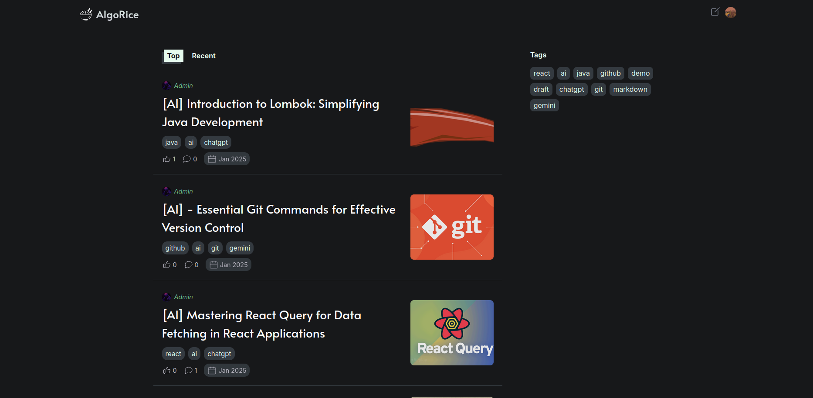

# Blog API project 

I had done a blog project before, but this time with a Spring Boot backend. This is also my first project with Typescript.

## Preview

  

  

  

### Libraries 
- React
- @tanstack -React Query
- React Router 
- React Markdown

### Langagues
- Typescript, SASS 
  